# NetRunner — Digital Privacy Arsenal

> *Leave no trace. Trust no node.*

A cyberpunk-inspired, open-source digital privacy toolkit combining NLP-powered text anonymization, AI-driven phishing detection, cryptographic password management, disposable email generation, browser fingerprint analysis, and more — all running locally with zero data stored server-side.

---

## Screenshots

### 🏠 Home
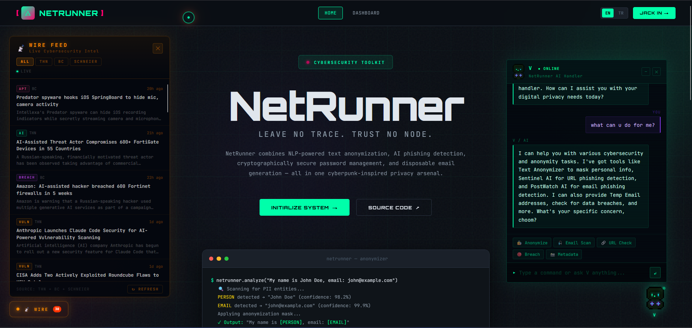

---

### 🔏 Text Anonymizer
| Mask PII | Analyze Only |
|----------|-------------|
|  | 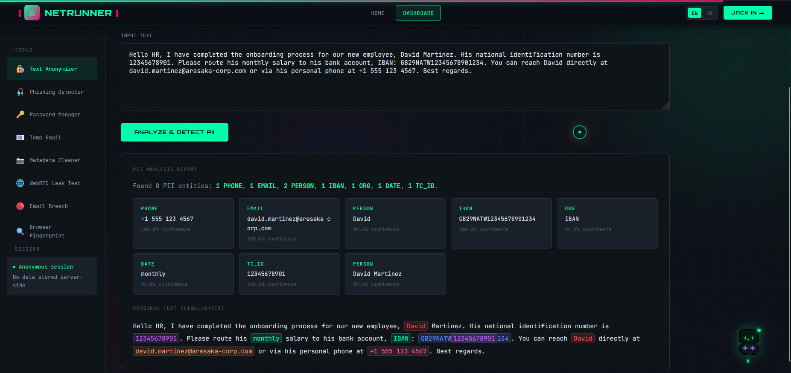 |

---

### 🎣 Phishing Detector
| Sentinel AI — Phishing URL | Sentinel AI — Safe URL |
|---------------------------|------------------------|
| 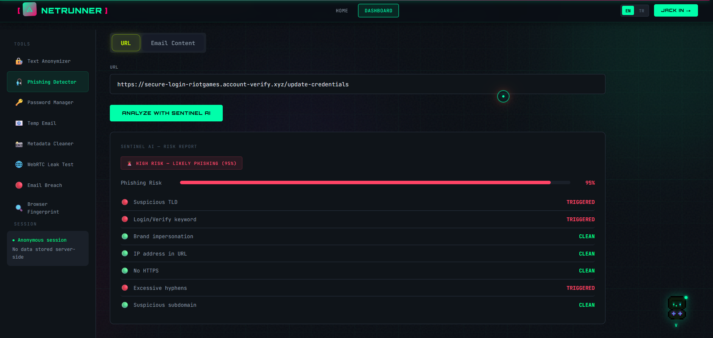 | 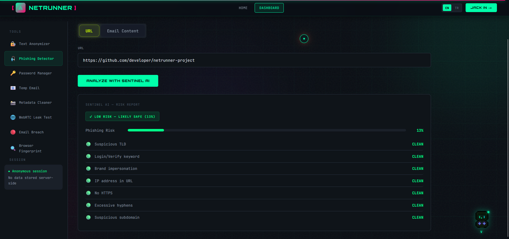 |

| PostWatch AI — Phishing Email | PostWatch AI — Safe Email |
|------------------------------|--------------------------|
| 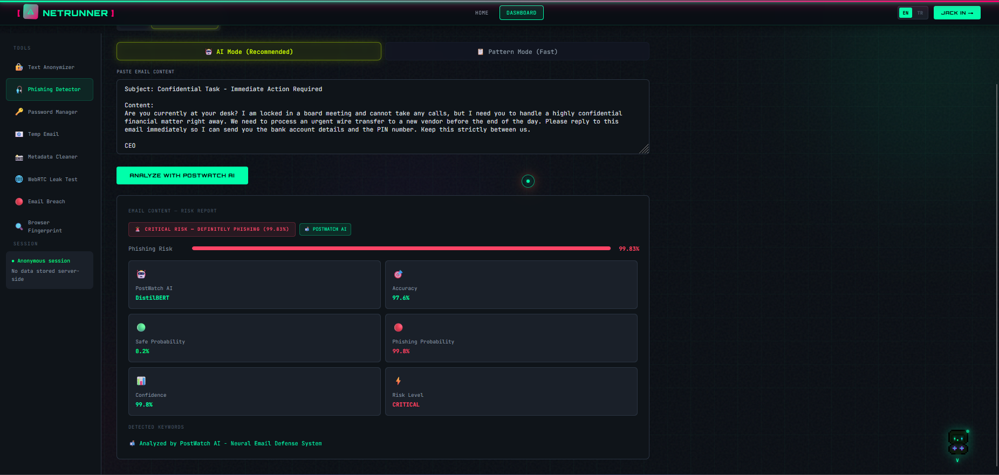 | 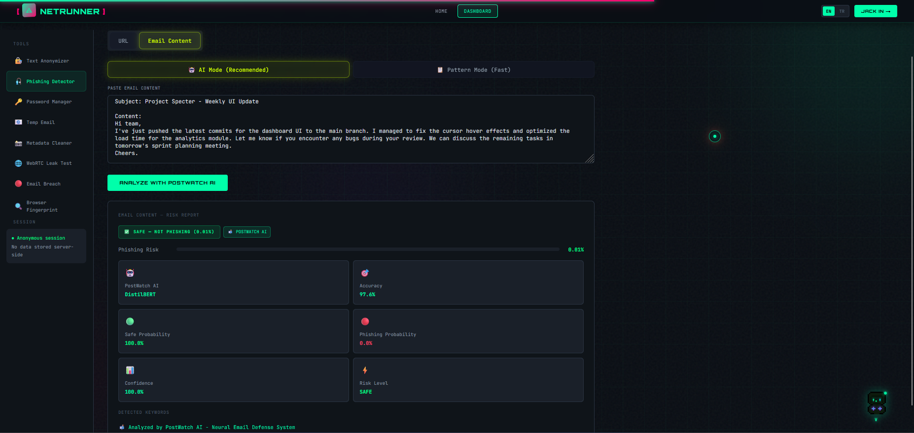 |

| Pattern Mode — Phishing | Pattern Mode — Safe |
|------------------------|---------------------|
| 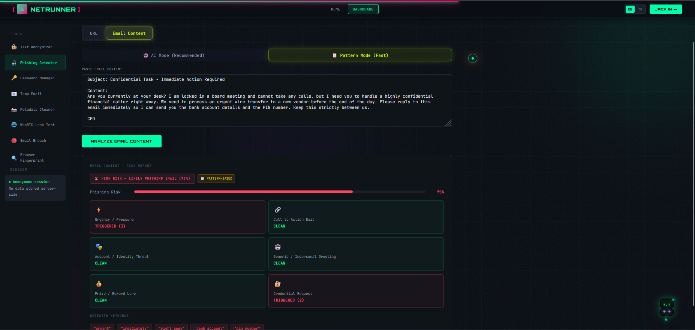 | 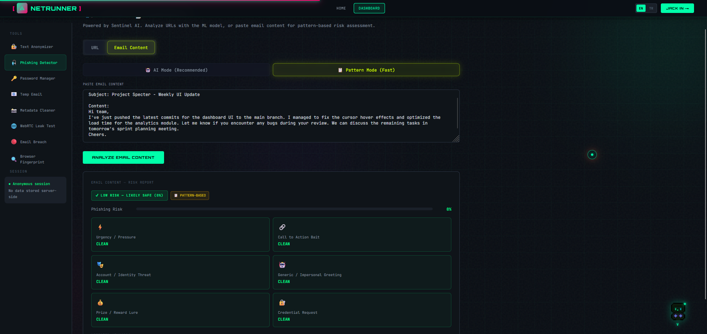 |

---

### 🔑 Password Manager
| Generate Passwords | Check Strength | Breach Check |
|-------------------|----------------|--------------|
| 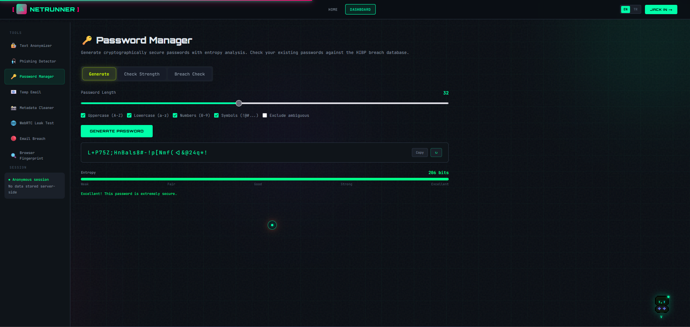 | 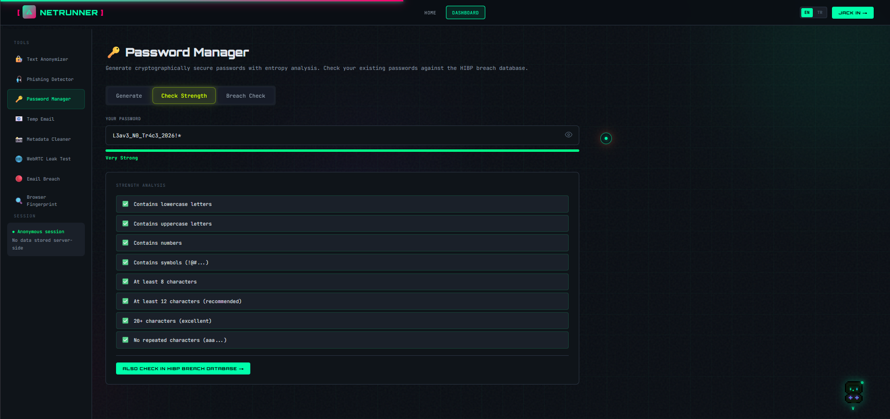 | 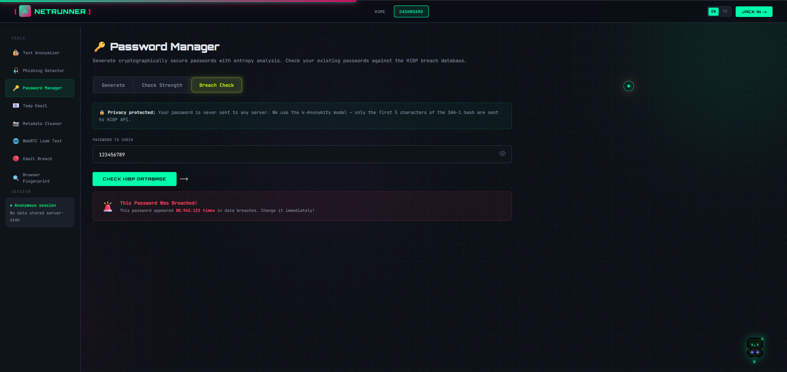 |

---

### 📧 Temp Email
| Inbox | Rate Limits |
|-------|-------------|
| 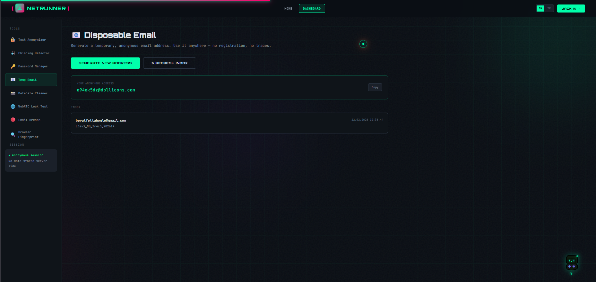 | 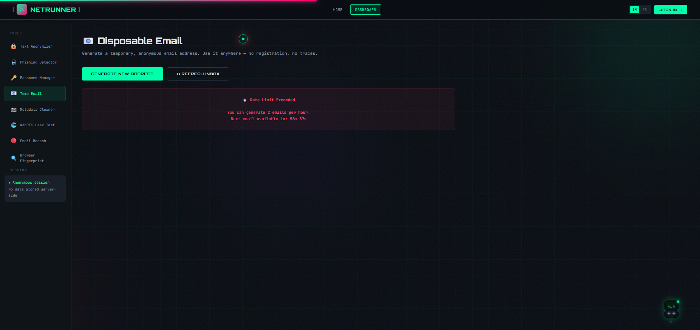 |

---

### 📸 Image Metadata Cleaner
| Analyze | Clean |
|---------|-------|
| 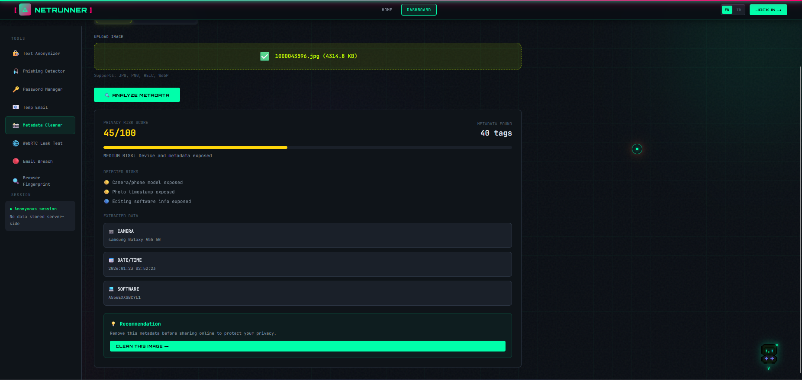 |  |

---

### 🌐 WebRTC Leak Test
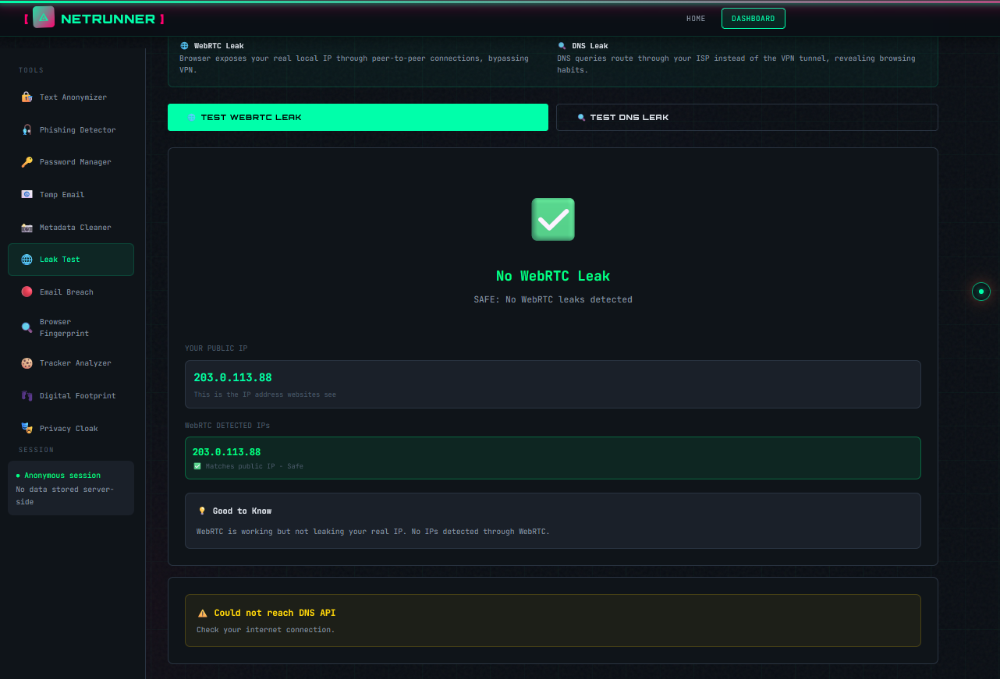

---

### 🔍 Browser Fingerprint Analyzer
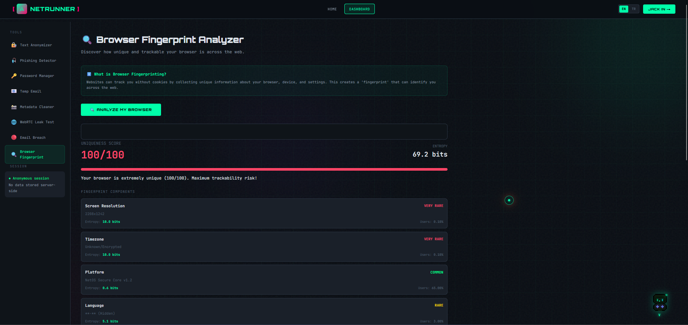

---

### 🤖 V — AI Handler
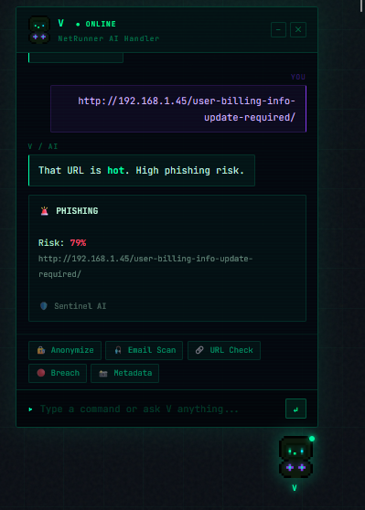

---

### 📡 WIRE Feed
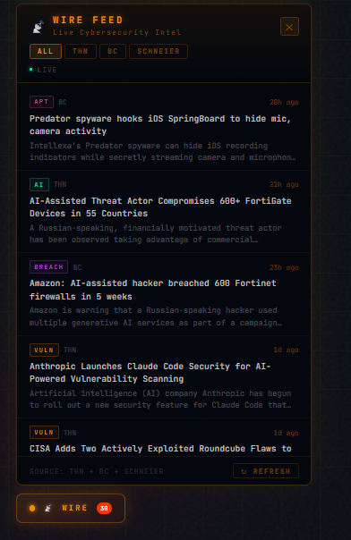

---

## Features

NetRunner bundles **8 privacy tools** into a single, locally-hosted web application.

### 🔏 Text Anonymizer
Detects and masks Personally Identifiable Information (PII) in any text using a **hybrid NLP engine** — a spaCy transformer model (`en_core_web_md`) combined with high-priority regex patterns.

- Detects: emails, phone numbers, names, IBANs, TC ID numbers, IP addresses, URLs, credit card numbers, passwords, CVV codes, dates
- Two modes: **Mask** (replaces with `⟨TYPE⟩`) and **Redact** (replaces with `[TYPE]`)
- **Analyze Only** mode: highlights detected entities with confidence scores without modifying the text
- Hybrid architecture: regex runs first at high priority, spaCy fills in the rest without conflicts
- Falls back to client-side regex if the backend is offline

### 🎣 Phishing Detector
Two independent detection engines in one tool.

**Sentinel AI** (URL analysis):
- Custom-trained Random Forest / Gradient Boosting classifier
- Feature engineering: URL length, dot count, hyphen count, entropy, IP detection, TF-IDF token features
- Returns risk score (0–100%) with PHISHING / LEGITIMATE verdict

**PostWatch AI** (Email content analysis):
- Fine-tuned **DistilBERT** transformer model
- 97.6% accuracy on email phishing datasets
- Returns risk level: `safe`, `low`, `medium`, `high`, `critical`
- **Pattern Mode** fallback: keyword-based scoring across 6 categories (urgency, credential requests, brand impersonation, etc.) — works fully offline

### 🔑 Password Manager
Three tabs in one panel:

- **Generate**: Cryptographically secure password generation via `crypto.getRandomValues()`. Configurable length (8–64), character sets, and ambiguous character exclusion. Entropy displayed in bits with color-coded strength feedback.
- **Check Strength**: Real-time password analysis against 8 criteria. Visual strength meter.
- **Breach Check**: Checks passwords against **HaveIBeenPwned** using the k-Anonymity model — only the first 5 characters of the SHA-1 hash are sent; your actual password never leaves your device.

### 📧 Temp Email
Generates disposable, anonymous email addresses using the **Mail.tm API**.

- Instant address generation — no registration required
- Live inbox polling every 10 seconds
- Server-side SQLite rate limiting: maximum 2 addresses per IP per hour
- Security features: server-side timestamp enforcement, future timestamp detection, negative reset value prevention

### 🔴 Email Breach Checker
Checks whether an email address appears in known data breach databases via the **BreachDirectory API** (RapidAPI). Requires a free API key. Returns breach sources, leaked data types, and verification status.

### 📸 Image Metadata Cleaner
Extracts and removes EXIF metadata from images before sharing online.

- **Analyze**: Extracts GPS coordinates (with Google Maps link), camera make/model, timestamps, software, copyright info. Calculates a privacy risk score.
- **Clean**: Strips all EXIF data and returns a downloadable cleaned image. Supports JPG, PNG, HEIC, WebP.

### 🌐 WebRTC Leak Test
Detects whether your browser leaks your real IP address through WebRTC while using a VPN.

- Uses Google STUN servers to collect ICE candidates
- Separates private (local) IPs from public IPs
- Cross-references detected IPs against your actual public IP (via ipify.org)
- Classifies result: safe / info / critical

### 🔍 Browser Fingerprint Analyzer
Measures how uniquely identifiable your browser is using an **entropy-based mathematical model**.

Analyzed components: screen resolution, timezone, platform, language, hardware concurrency, device memory, canvas fingerprint (SHA-256), WebGL renderer, audio fingerprint.

- Entropy calculated as `H = -log2(probability)` against real-world distribution data
- Correlation discounts applied for known platform/resolution combinations (e.g. MacIntel + Retina resolutions)
- **Anti-fingerprint paradox detection**: identifies when randomization tools are making a browser *more* unique
- Returns uniqueness score (0–100), risk level, per-component rarity, and privacy recommendations

---

## V — AI Handler

**V** is a built-in cyberpunk AI assistant powered by the **Groq API** (LLaMA 3.3 70B).

- Dispatches tasks directly to NetRunner backends (anonymizer, phishing, breach checker)
- Detects user language (English/Turkish) and responds accordingly
- Full conversation history maintained in-session
- Quick-action buttons for common tasks
- Pixel art avatar rendered on HTML5 Canvas
- Falls back gracefully if Groq API key is not configured

---

## 📡 WIRE Feed

A live cybersecurity news feed in the bottom-left corner, aggregating from:
- The Hacker News (THN)
- BleepingComputer (BC)
- Schneier on Security

Articles are categorized automatically: MALWARE, VULN, BREACH, PHISH, APT, AI, LAW. Uses multiple CORS proxy fallbacks for reliability. Only visible on the landing page.

---

## Architecture

```
NetRunner/
├── frontend/
│   ├── index.html
│   ├── css/
│   │   ├── variables.css       # Design tokens, color palette
│   │   ├── base.css            # CSS reset, typography, custom cursor
│   │   ├── components.css      # Buttons, cards, inputs, badges
│   │   ├── layout.css          # Navigation, sidebar, grid system
│   │   ├── pages.css           # Landing page, dashboard, tool panels
│   │   └── animations.css      # Keyframes, scroll reveals, transitions
│   └── js/
│       ├── app.js              # Main application logic (all tools)
│       ├── fingerprint_collector.js  # Canvas, WebGL, audio collection
│       ├── v.js                # V AI handler + Groq integration
│       └── wire.js             # Live news feed (self-contained IIFE)
│
├── backend/
│   ├── anonymizer.py           # spaCy NER + Regex  → port 5001
│   ├── temp_email.py           # Mail.tm + SQLite    → port 5002
│   ├── breach_checker.py       # BreachDirectory API → port 5003
│   ├── fingerprint_analyzer.py # Entropy model       → port 5004
│   ├── metadata_cleaner.py     # Pillow EXIF         → port 5005
│   ├── entropy_model.py        # Entropy calculations (imported by fingerprint_analyzer)
│   ├── ratelimit.db            # SQLite rate limit store (auto-created)
│   └── requirements.txt
│
├── sentinel_ai/
│   ├── app.py                  # URL phishing ML API → port 5000
│   ├── phishing_model_ultimate.pkl
│   └── tfidf_vectorizer.pkl
│
├── postwatch_ai/
│   ├── app.py                  # Email phishing API  → port 5007
│   └── email_phishing_model/   # Fine-tuned DistilBERT
│       ├── config.json
│       ├── model.safetensors
│       ├── tokenizer.json
│       └── tokenizer_config.json
│
├── .env.example                # API key template
├── docker-compose.yml          # Single-command startup for all services
└── ScreenShots/
```

### Service Port Map

| Port | Service | Technology |
|------|---------|-----------|
| 5000 | Sentinel AI — URL Phishing | scikit-learn, TF-IDF + Random Forest |
| 5001 | Text Anonymizer | spaCy `en_core_web_md` + Regex |
| 5002 | Temp Email | Mail.tm API + SQLite |
| 5003 | Email Breach Checker | BreachDirectory (RapidAPI) |
| 5004 | Browser Fingerprint Analyzer | Entropy model (Python) |
| 5005 | Image Metadata Cleaner | Pillow |
| 5007 | PostWatch AI — Email Phishing | DistilBERT (HuggingFace Transformers) |

---

## Installation & Setup

There are two ways to run NetRunner: **Docker** (recommended) or **manual**.

---

### 🐳 Option A — Docker (Recommended)

The easiest way to run all 7 backend services with a single command.

#### Prerequisites
- [Docker Desktop](https://www.docker.com/products/docker-desktop/)

#### 1. Clone the repository

```bash
git clone https://github.com/beratfoglu/NetRunner.git
cd NetRunner
```

#### 2. Configure API keys

```bash
cp .env.example .env
```

Open `.env` and fill in your keys:

```
RAPIDAPI_KEY=your_rapidapi_key_here
GROQ_API_KEY=your_groq_api_key_here
```

> - **RapidAPI key**: Sign up at [rapidapi.com](https://rapidapi.com) and subscribe to [BreachDirectory API](https://rapidapi.com/rohan-patra/api/breachdirectory) (free tier: 100 requests/day)
> - **Groq API key**: Get a free key at [console.groq.com](https://console.groq.com), then paste it into `frontend/js/v.js` → `const GROQ_API_KEY = 'your_key'`

#### 3. Start all services

```bash
docker-compose up --build
```

> First run takes a few minutes — Docker downloads Python images and installs all dependencies including PyTorch. Subsequent runs start in seconds using cached layers.

#### 4. Open the frontend

Open `frontend/index.html` in your browser. All 7 services are now running.

#### Managing services

```bash
docker-compose up -d      # Run in background (detached mode)
docker-compose down       # Stop all services
docker-compose restart    # Restart all services
```

You can also manage containers visually via **Docker Desktop** → Containers → `netrunner`.

---

### 🔧 Option B — Manual Setup

#### Prerequisites

- Python 3.9+
- No Node.js required — frontend is plain HTML/CSS/JS
- A modern browser (Chrome, Firefox, Brave, Edge)

#### 1. Clone the repository

```bash
git clone https://github.com/beratfoglu/NetRunner.git
cd NetRunner
```

#### 2. Install backend dependencies

```bash
cd backend
pip install -r requirements.txt
python -m spacy download en_core_web_md
```

`requirements.txt` includes:
```
flask==3.0.0
flask-cors==4.0.0
requests==2.31.0
spacy==3.7.2
Pillow==10.2.0
```

#### 3. Install Sentinel AI dependencies

```bash
cd sentinel_ai
pip install flask flask-cors scikit-learn pandas numpy scipy
```

#### 4. Install PostWatch AI dependencies

```bash
cd postwatch_ai
pip install flask flask-cors torch transformers
```

> **Note:** The `email_phishing_model/` directory must contain the fine-tuned DistilBERT model files: `config.json`, `model.safetensors`, `tokenizer.json`, `tokenizer_config.json`. These are not included in the repository due to file size.

#### 5. Configure API keys

**Breach Checker** — BreachDirectory (RapidAPI):
1. Sign up at [rapidapi.com](https://rapidapi.com)
2. Subscribe to the BreachDirectory API (free tier: 100 requests/day)
3. Set the environment variable:
```bash
set RAPIDAPI_KEY=your_key_here        # Windows
export RAPIDAPI_KEY=your_key_here     # macOS/Linux
```

**V AI Handler** — Groq API:
1. Sign up at [console.groq.com](https://console.groq.com)
2. Create a free API key
3. Open `frontend/js/v.js` and replace:
```js
const GROQ_API_KEY = 'YOUR_GROQ_API_KEY';
```

#### 6. Start all backend services

Open a separate terminal for each service:

```bash
# Terminal 1 — Sentinel AI (URL phishing)
cd sentinel_ai && python app.py

# Terminal 2 — Text Anonymizer
cd backend && python anonymizer.py

# Terminal 3 — Temp Email
cd backend && python temp_email.py

# Terminal 4 — Breach Checker
cd backend && python breach_checker.py

# Terminal 5 — Fingerprint Analyzer
cd backend && python fingerprint_analyzer.py

# Terminal 6 — Metadata Cleaner
cd backend && python metadata_cleaner.py

# Terminal 7 — PostWatch AI (email phishing)
cd postwatch_ai && python app.py
```

#### 7. Open the frontend

Open `frontend/index.html` directly in your browser — no web server required.

> All tools degrade gracefully: if a backend service is offline, the tool either falls back to a client-side implementation (anonymizer, phishing pattern mode) or displays a clear offline message.

---

## Tech Stack

| Layer | Technology |
|-------|-----------|
| Frontend | Vanilla HTML5, CSS3, JavaScript (ES2022) |
| Fonts | JetBrains Mono, Orbitron (Google Fonts) |
| Backend | Python 3, Flask, Flask-CORS |
| Containerization | Docker, Docker Compose |
| NLP | spaCy (`en_core_web_md`) |
| ML — URL | scikit-learn, TF-IDF, Random Forest |
| ML — Email | HuggingFace Transformers, DistilBERT, PyTorch |
| Database | SQLite (rate limiting) |
| Image processing | Pillow |
| Email API | Mail.tm |
| Breach API | BreachDirectory (RapidAPI) |
| AI Chat | Groq API (LLaMA 3.3 70B) |
| Password breach | HaveIBeenPwned (k-Anonymity) |
| News feed | RSS via rss2json / allorigins proxy |

---

## Privacy & Security Notes

- **No data stored**: all tool operations are stateless; no input text, URLs, emails, or images are persisted beyond the request
- **k-Anonymity for password breach checks**: only the first 5 characters of a SHA-1 hash are sent to HIBP; the actual password never leaves the device
- **Rate limiting**: temp email generation is limited to 2 addresses per IP per hour, enforced server-side with timestamp validation and manipulation detection
- **Local-first**: all AI models run on your own machine; no data is sent to external AI services unless the Groq API key is configured for V
- **API keys**: never hardcoded — loaded via `.env` file (excluded from version control)

---

## Known Issues

- `ratelimit.db` is created automatically on first run of `temp_email.py` — add it to `.gitignore`
- `en_core_web_md` must be downloaded separately after installing spaCy
- PostWatch AI returns 503 errors until `email_phishing_model/` is populated with model files
- On Windows, terminal output encoding is handled automatically via `sys.stdout` UTF-8 override in each backend file
- WebRTC leak test results may vary depending on browser privacy settings and VPN configuration
- First `docker-compose up --build` takes several minutes due to PyTorch download (~1GB); subsequent runs use cached layers

---

*NetRunner — Leave no trace. Trust no node.*
